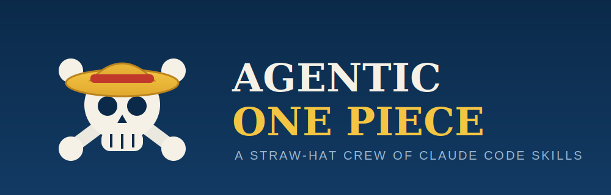

<p align="center">
  
</p>

# 🏴‍☠️ Agentic One Piece

A Straw-Hat crew of [Claude Code](https://claude.com/claude-code) **agent skills** — each one a named crewmate with a job to do. Hand the crew a plan and they'll build it, navigate it to a green PR, plate the design, and chart the codebase.

Every skill is a self-contained `SKILL.md`. Claude Code loads them automatically and invokes them by name (e.g. `/luffy`, `/nami`) or when a task matches the skill's description.

---

## ⚓ The Crew

| Skill | Role | What it does |
|-------|------|--------------|
| **🧢 [luffy](skills/luffy/SKILL.md)** | Captain — Builder | Autonomously implements a planned feature end-to-end, then drives it through a QA + Design + Engineer review loop until clean, verifies it runs, and ships a green PR. |
| **🍊 [nami](skills/nami/SKILL.md)** | Navigator — Shipper | Takes a branch or PR to a green, reviewed state: pushes, opens/updates the PR, and loops on CI + review comments — fixing real issues and pushing back on wrong ones. |
| **🍳 [sanji](skills/sanji/SKILL.md)** | Cook — Design Reviewer | Reviews UI work as a senior product designer against the project's design system, returning severity-ranked findings and a ship/iterate/block verdict. |
| **🎯 [usopp](skills/usopp/SKILL.md)** | Sniper — Architect | Deeply explores a codebase, understands its mechanics, and produces or updates `MECHANICS.md` as a living architectural reference. |

---

### 🧢 luffy — *autonomous feature builder*

Hand luffy a plan or spec (a file path or an inline description) and it builds the feature like a senior engineer, self-reviews through an iterative **QA + Design/Product + Engineer** loop, proves it actually runs with `/verify`, takes it to a green reviewed PR via `/nami`, and finishes with a standup-style session log.

**Triggers:** `/luffy <plan>` · "run luffy on this plan" · "autonomously implement this feature" · "build this and review it until clean"

### 🍊 nami — *navigator to a green PR*

nami takes the helm on a branch or PR. It pushes, opens or updates the PR, then loops on the two external signals — **CI results** and **review comments** (bots + humans) — critically evaluating each: fixing real problems and pushing back on wrong suggestions, until checks are green and nothing blocking is unresolved. Also invoked in-context by luffy's ship phase.

**Triggers:** `/nami` · "take this to a green PR" · "get CI green" · "address the PR comments" · "babysit this PR till it's green"

### 🍳 sanji — *senior design reviewer*

sanji reviews UI work — a PR, a diff, or a component — as a senior product (UX/UI) designer. It judges interaction quality, visual consistency, accessibility, content, and states against the repo's own `DESIGN.md` (binding source of truth; falls back to general craft when none exists), and returns severity-ranked findings with a **ship / iterate / block** verdict. Design only — it defers correctness bugs to `/code-review` and luffy.

**Triggers:** `/sanji <pr#|path>` · "review the design" · "sanji review this PR"

### 🎯 usopp — *codebase architect*

usopp is a senior staff engineer who deeply explores a codebase to understand its architecture, design decisions, and mechanics, then produces or updates **`MECHANICS.md`** as a living architectural reference. First run generates the doc; subsequent runs read it first and update only what has changed.

**Triggers:** `/usopp` · "document the architecture" · "update MECHANICS.md"

---

## 🗺️ A typical voyage

```
usopp   →  chart the codebase (MECHANICS.md)
luffy   →  build the feature from a plan
sanji   →  review the design of the UI changes
nami    →  drive the PR to green and ship it
```

luffy already calls `sanji`, `nami`, and `/verify` internally during its review and ship phases — so for a full feature you can often just set sail with `/luffy <plan>`.

---

## 📦 Installation

These are user-level Claude Code skills. Drop each skill folder into your skills directory:

```bash
# clone, then symlink (or copy) the crew into your Claude Code skills dir
git clone https://github.com/<you>/agentic-onepiece.git
cd agentic-onepiece

for skill in luffy nami sanji usopp; do
  ln -s "$PWD/skills/$skill" "$HOME/.claude/skills/$skill"
done
```

Or copy them instead of symlinking:

```bash
cp -R skills/* "$HOME/.claude/skills/"
```

Restart Claude Code (or start a new session) and the crew will be available by name.

---

## 📁 Repository layout

```
agentic-onepiece/
├── README.md
├── assets/
│   └── banner.svg
└── skills/
    ├── luffy/SKILL.md
    ├── nami/SKILL.md
    ├── sanji/SKILL.md
    └── usopp/SKILL.md
```

---

<p align="center"><em>“I'm gonna be King of the Pirates!” 🏴‍☠️</em></p>
